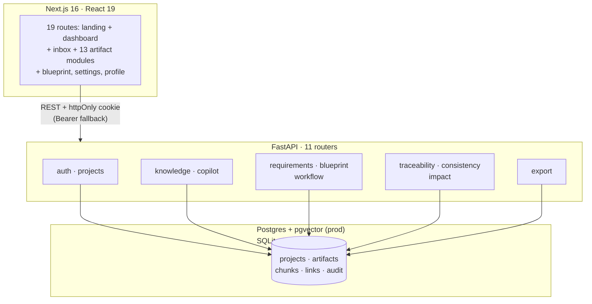
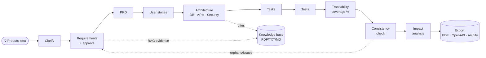

# BlueprintAI — AI-Powered SDLC & Engineering Blueprint Platform


> Idea → PRD → user stories → architecture → DB/APIs/security → tasks → tests, with RAG-grounded generation, traceability, consistency checks, impact analysis, and PDF export. **Deterministic metrics only — the LLM never invents coverage.**

Full spec: `docs/SPEC.md` · Security: `docs/SECURITY.md` · Measured numbers: `docs/EVALUATION.md` · Contributing: `CONTRIBUTING.md`

## System architecture



## Artifact pipeline (every handoff is human-approved)



## Features

| Area | What works |
|---|---|
| 13 artifact modules | Requirements, PRD, Stories, Architecture, Database, APIs, Security, Tasks, Tests, Traceability, Consistency, Impact, Knowledge — no stubs |
| RAG-grounded generation | Upload PDF/TXT/MD (≤15MB) → structure-aware chunks → hash/OpenAI embeddings → hybrid vector+lexical retrieval; generations cite evidence or say what's missing |
| Multi-agent pipeline | LangGraph workflow with sequential fallback; the engine that ran is reported, not assumed |
| Collaboration safety | httpOnly `SameSite=Lax` sessions, `project_or_403` isolation, optimistic locking (409), audit logs, prod fail-closed config |
| Export | Full-blueprint PDF (ReportLab, markup-escaped), OpenAPI 3.0, Archify diagram IR (1:1 topology) |
| Quality gates | 35 pytest green, retrieval + pipeline benchmark, `tsc` + `next build` clean |

## Measured results (not claims)

From `evaluation/benchmark.py --full --repeats 3` — temp SQLite DB, mock LLM, hash embeddings. Re-run to reproduce.

| Benchmark | Measured |
|---|---|
| Retrieval Recall@3 (35 keyword queries) | **1.00** |
| Retrieval Recall@3 (8 adversarial paraphrases) | **0.25** — the honest gap semantic embeddings must close |
| Pipeline (3 ideas × 3 runs) | **9/9 green, 0 failures** |
| Traceability per idea | **100%, 0 orphans** |
| End-to-end latency per idea | **~0.4–0.9 s** mean, per-stage means <100 ms |

The fixture once caught a real stemming bug (`writes`≠`write`): prefix-token normalization moved Recall@3 0.80 → 0.90 with all 35 tests still green. See `docs/EVALUATION.md`.

## AI providers: mocked by default, on purpose

Local development runs with **no keys, no GPU, no network calls**:

- **LLM:** `LLM_PROVIDER=mock` (default). Generation is deterministic templates so
  tests, benchmarks, and the seed demo are reproducible offline.
- **Embeddings:** `EMBEDDING_PROVIDER=hash` (default) — deterministic local
  vectors.

Want real AI prose instead of mock templates? Two free options (no credit card),
both verified OpenAI-compatible with this codebase:

| | Google AI Studio (Gemini) | Groq (Llama/Qwen) |
|---|---|---|
| Get key | `aistudio.google.com/apikey` | `console.groq.com/keys` |
| Free quota | ~1500 req/day (Flash) | ~14k req/day |
| `.env` | `LLM_PROVIDER=openai` + `OPENAI_API_KEY=<key>` + `OPENAI_MODEL=gemini-2.5-flash` + `OPENAI_BASE_URL=https://generativelanguage.googleapis.com/v1beta/openai/` | `LLM_PROVIDER=openai` + `OPENAI_API_KEY=<key>` + `OPENAI_MODEL=llama-3.3-70b-versatile` + `OPENAI_BASE_URL=https://api.groq.com/openai/v1` |

Check current model ids on the provider console — they rotate. Restart uvicorn
after editing `.env`. Copilot AI mode works with the same key via
`LLM_API_KEY`/`LLM_BASE_URL`/`LLM_MODEL` (or just `OPENAI_API_KEY`).

Measured quality numbers below are from the mock/hash path unless labeled.

## Tech stack

| Layer | Tech |
|---|---|
| Backend | FastAPI 0.141, Uvicorn, SQLAlchemy 2.0, Pydantic v2, PyJWT + bcrypt, PyMuPDF, ReportLab |
| AI / RAG | LangGraph, OpenAI SDK, hash embeddings with OpenAI path + ablation harness (mock LLM + hash vectors by default — see above) |
| DB | Postgres + pgvector (prod) / SQLite fallback (local) |
| Frontend | Next.js 16.3.5, React 19.3, Tailwind 4.3, TanStack Query, @xyflow/react, TypeScript (strict) |
| Infra | GitHub Actions CI (pytest + typecheck + build), `scripts/init_db.py`, `scripts/seed_demo.py` |

## Screenshots

> Add 2–3 captures here after first run (`screenshots/`).

```
screenshots/dashboard.png   # project overview + artifact progress
screenshots/blueprint.png   # PRD → stories → architecture flow
screenshots/traceability.png# coverage, orphans, consistency issues
```

## Demo (2 minutes, local)

```powershell
python scripts/seed_demo.py   # demo@blueprint.ai / demo12345
uvicorn app.main:app --reload --app-dir backend --port 8000
cd frontend; npm run dev
```

Open http://localhost:3000/dashboard, log in with the demo account, open the
seeded project: requirements → traceability graph → consistency issues →
`export/pdf`. No live public demo is deployed yet.

## Quickstart (8GB-friendly, no Docker)

```powershell
# 1. Backend
python -m venv .venv; .\.venv\Scripts\Activate
pip install -r backend/requirements.txt
copy .env.example .env
python scripts/init_db.py
python scripts/seed_demo.py   # optional: demo@blueprint.ai / demo12345
uvicorn app.main:app --reload --app-dir backend --port 8000
# health: http://localhost:8000/health

# 2. Frontend
cd frontend; npm install; npm run dev
# landing: http://localhost:3000/  ·  app: http://localhost:3000/dashboard
```

Default DB is SQLite (`devblueprint.db`) so it runs immediately.
For full Postgres+pgvector: run `scripts/install_postgres_windows.ps1` as Admin, create DB, set `DATABASE_URL` in `.env`.

## Docker (full stack: API + web + Postgres/pgvector)

```powershell
copy .env.example .env   # then set JWT_SECRET (32+ chars) in .env
docker compose up --build
# API http://localhost:8000  ·  web http://localhost:3000
```

`JWT_SECRET` is required — compose and the API both refuse to boot without a
real secret. `OPENAI_API_KEY` is optional (mock path is the default).
To deploy: build the two images, provide the same env vars
(`DATABASE_URL`, `JWT_SECRET`, `CORS_ORIGINS`, optional `OPENAI_API_KEY`),
and point the frontend's `NEXT_PUBLIC_API` build arg at the API URL.
`ENV=prod` disables API docs and detailed health output.

## MVP flow

Create Project → Clarify → Generate Requirements → Approve → PRD → Stories → Architecture → DB/APIs/Security → Tasks → Tests → Traceability → Consistency → Impact → Export.

## API (selected)

| Method + path | Description |
|---|---|
| `POST /auth/register`, `/login`, `/logout`, `GET /me` | Email + bcrypt auth, httpOnly cookie session |
| `POST/GET /projects`, `GET /projects/{id}` | Project create/list/detail, member guard via `project_or_403` |
| `POST /projects/{id}/requirements/generate`, `POST /requirements/{id}/approve` | RAG-grounded requirement drafts + approval with locking |
| `GET /projects/{id}/prd`, `/stories`, `/architecture`, `/database`, `/apis`, `/security`, `/tasks`, `/tests` | Artifact retrieval (POST `…/generate` creates them) |
| `GET /projects/{id}/traceability` | Coverage %, orphans, stored links (paginated) |
| `POST /projects/{id}/consistency/check` | Deterministic cross-artifact checks + AI explanation |
| `POST /projects/{id}/impact/analyze` | Affected artifacts for a requirement change (404 on unknown REQ) |
| `GET /projects/{id}/export/pdf`, `/export/openapi`, `/export/archify` | PDF + OpenAPI + Archify diagram IR export |

## Verify

```powershell
# Backend: unit + E2E + regression (35 green, isolated temp DB per run)
$env:PYTHONPATH="backend"; python -m pytest backend/tests -q

# Measured benchmark (retrieval fixture + 3-idea pipeline — see docs/EVALUATION.md)
$env:PYTHONPATH="backend"; python evaluation/benchmark.py --full --repeats 3

# With an OpenAI key: adds the semantic-embedding leg on the same fixture
$env:OPENAI_API_KEY="<key>"; $env:PYTHONPATH="backend"; python evaluation/benchmark.py --embeddings both

# Frontend production build + typecheck
cd frontend; npm ci; npm run build; npm run typecheck
```

## Project structure

```
backend/app/      # api/routes (11), models, rag/, agents/, core/, traceability/, consistency/, impact/
frontend/         # app/(landing + dashboard + 17 project routes), components, lib/api (+types), lib/query
docs/             # SPEC.md, ARCHITECTURE.md, SECURITY.md, EVALUATION.md, THIRD_PARTY_NOTICES.md
evaluation/       # benchmark.py (43-query retrieval fixture + ablation + pipeline matrix)
scripts/          # init_db.py, seed_demo.py, install_postgres_windows.ps1
docker-compose.yml# api + web + pgvector DB (backend/Dockerfile, frontend/Dockerfile)
screenshots/      # add demo captures here
```

## What I learned

- Scoped RAG joins + `project_or_403` for multi-tenant isolation; hash-embedding fallback keeps local dev free.
- Optimistic locking + audit logs for safe human-in-the-loop approvals.
- An evaluation harness that reports split metrics (keyword vs adversarial) beats "it runs" demos — it found a real stemming bug and proved the fix.
- Fail-closed config and typed API boundaries are what make a demo survive contact with reviewers.
